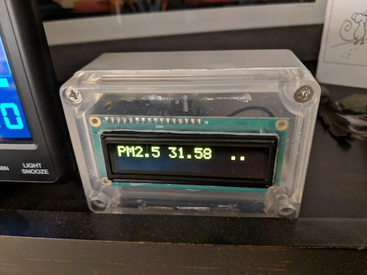

PurpleAir Display
=================

PurpleAir air quality monitors are neat: they have a bunch of sensors and
upload local air quality and temperature data to PurpleAir's website, where it
gets used on WeatherUnderground and other citizen weather services.

While the PurpleAir map is nice, there is no official way to view the sensor
data locally or offline. This small project fills that need.

Install / Usage
---------------

1. Clone this repo.
2. Copy `config.example.h` to `config.h` and make sure your wifi SSID and
   password are correct, and that `api_server` points to your PurpleAir device.
3. Open `PurpleAir_OLED_display-OTA.ino` in Arduino IDE.
4. Setup Arduino IDE with the [Espressif board definitions](https://github.com/espressif/arduino-esp32#installation-instructions).
5. Install `Adafruit_CharacterOLED` and `ArduinoJson` libraries via "Manage
   Libraries..." menu.
6. Hook up the OLED to the HUZZAH32 using the pinout written in the .ino file.
7. Select "Adafruit ESP32 Feather" as the board, "80MHz" flash frequency,
   "9216800" flash speed, and your USB connection for port.
8. Upload!

You can also flash the board directly via esptool.py, but then you're on your
own to install all the relevant libraries and build everything.

Over The Air (OTA) Updates
--------------------------

After the initial firmware upload, you'll be able to flash the device over the
network by selecting it's hostname and IP address instead of the USB/serial
connection for the port in Arduino IDE!

Design
------

It turns out PurpleAir devices have a small web server with an (undocumented)
JSON API at http://<device_ip>/json

This project uses:

* [Adafruit HUZZAH32](https://www.adafruit.com/product/3405) - 
  A devboard for the excellent Espressif ESP32 Wifi/BLE SoC which has a
  boatload of features
* [Sparkfun 16x2 Yellow OLED](https://www.sparkfun.com/products/retired/11987) - 
  Now discontinued, uses the RS0010 chipset, really any 16x2 display will work
* [A project box](https://www.amazon.com/gp/product/B072FS4118/) - 
  4.5"x3.5"x2.2" worked perfectly, with a hole Dremeled into the clear lid for
  the display to poke through and another hole in the side for microUSB power

These libraries are all installable in the Arduino IDE via "Manage Libraries..." menu:

* Adafruit_CharacterOLED
* ArduinoJson

These libraries come with the Espressif board definitions. They're also
available in "Manage Libraries..." but don't install them there, best to use
ESP32 versions:

* Wifi
* ESPmDNS
* ArduinoOTA

### Version 1

Version 1 was the initial implementation and while it works it's poorly
designed. Don't use it, use the most recent one instead (anything without -v1
in the filename). It's left here as an example of the good-enough MVP.

Problems include:

* No over the air updates, can only change firmware over USB
* Configuration details directly in the code is less portable and more
  prone to accidentally submitting secrets to source control
* Timing is done with delay() calls which is blocking and breaks long running
  operations, like slow HTTP responses or OTA updates (which is why OTA isn't
  in this version)

Troubleshooting
---------------

First make sure config.h is present in the same directory as your .ino file.

If you set `DEBUG_STRINGS true` in `config.h` and connect to the HUZZAH32's
serial port you should see a bunch of debug output that can help you pinpoint
the problem.

Open an issue or, better yet, become a contributor by sending me a PR!
